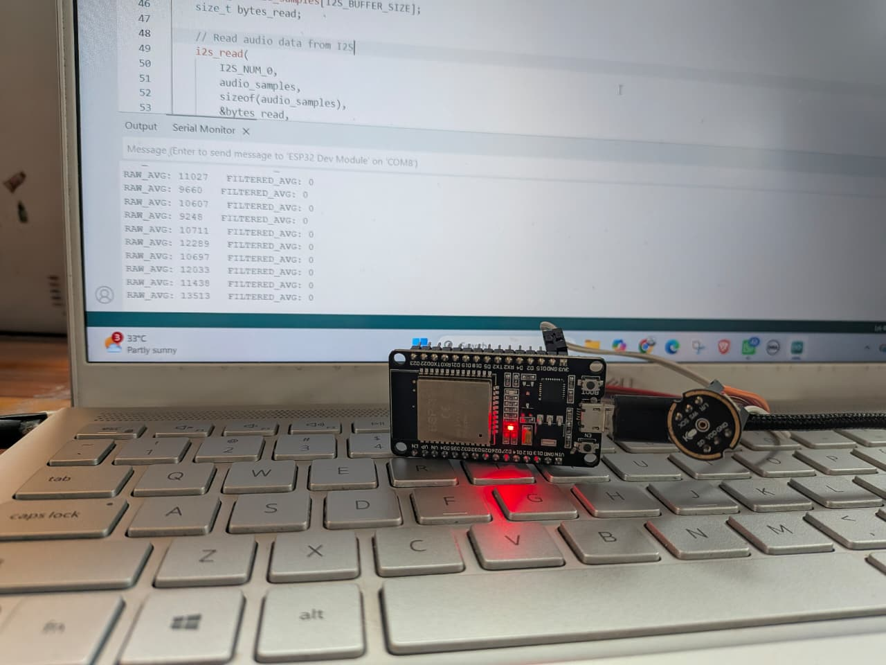

 <h2 align="center"> Daily Worklog (After Training Week)</h2>
 
 ## 8 June 2026

- Discussed the *SCAMPER Framework* for the ideation phase.
- Applied the framework to a real pain point faced by our team.
- Developed a solution around the problem statement:

  > Develop a smart system that enables wireless controllers to be easily located and proactively alert users when they are misplaced.

- Prepared a presentation explaining the problem statement and our proposed solution.
  
---

## 9 June 2026

- Thought of and researched everyday problems faced by people in daily life to identify potential areas for innovation and problem-solving.
- Started learning the basics of the **ESP32** and **IO Shield**.
- Learned to blink LEDs using the ESP32.
- Created different LED patterns and sequences.
- Explored the use of a buzzer.

---

## 10 June 2026

- Presented a problem statement developed using the **SCAMPER Framework**.
- Explored and discussed multiple potential problem statements and their feasibility.
- Received valuable insights and feedback from professors regarding our logic, approach, and thought process.
- Refined our understanding of problem identification and solution development through discussions and evaluations.

---

## 11 June 2026

- Narrowed down and finalized the problem statement for further development.
- The "Acoustic Fingerprint" Subsurface Leak Detector (IoT & Infrastructure)
- Conducted additional research on the selected problem statement.
- Gained deeper insights into the problem domain and its real-world significance.
- Improved clarity regarding the scope, challenges, and potential solution approaches.
- Built an **8-bit binary counter** using LEDs and the ESP32 module.
- Learned how binary counting can be represented and visualized using LEDs.

---

## 12 June 2026

- Learned the basics of KiCad
- Narrowed down our problem statement and chose to work on a "Tap Leak Detector"
- Further conducted our research towards the above problem statement 
- Compiled a list of 50 problems for the problem sheet.

---

## 13 June 2026

- Researched the **Water Tap Leak Detection System** problem statement and explored its practical applications.
- Investigated additional problem statements to evaluate their feasibility and impact.
- Contributed new ideas and added more potential problem statements to the team's list of 50 problem statements.
- Began researching the **Helmet Pillion Communication** problem statement, focusing on existing solutions and potential areas for innovation.

---

## 15 June 2026

- Finalized the project problem statement:

  > Motorcycle riders often struggle to communicate with pillion passengers due to environmental noise during travel. Wind, engine, and traffic noise significantly reduce speech clarity, making real-time communication difficult and distracting.

- Conducted thorough research to understand the problem domain and validate the proposed solution.
- Analyzed the advantages, limitations, and challenges associated with the project.
- Explored various hardware components and technologies suitable for implementing the solution.

---

## 16 June 2026

- Evaluated different component options based on functionality, compatibility, and project requirements.
- Compared component specifications and suitability to ensure alignment with the project objectives.
- Prepared the component list for procurement and future implementation stages.
- Designed a block diagram explaining the logic

---

## 17 June 2026

- Finalized the component list required for the project.
- Reviewed component specifications and compatibility for system integration.
### MEMS Microphone

---

## 18 June 2026

- Performed initial testing of the MEMS microphone.
- Verified microphone functionality and audio signal acquisition.

---

## 20 June 2026

- Captured and analyzed environmental noise samples.
- Studied sources of noise such as wind, engine, and traffic sounds.
- Explored noise filtering techniques using the ESP32 for improved voice clarity.
### Noise filtering attempts 

---

## 22 June 2026

- Analyzed and tested the speech transmission code used for audio communication between the MEMS microphone and Bluetooth earbuds. 
- Investigated the data flow through the ESP32 to identify potential sources of audio loss and latency.
- Documented observed issues and evaluated areas for further optimization and debugging.

---

## 23 June 2026

- Worked on debugging potential errors in the speech transmission system and analyzed their impact on audio quality. 
- Tested various voice filtering techniques to improve speech clarity and reduce unwanted background noise.
- Evaluated filter performance and documented observations for further optimization.
  
---

## 24 June 2026

- Conducted a detailed review and scrutiny of the speech transmission code. Analyzed the existing implementation, modified key parameters, and optimized several variables to improve overall system performance and stability.
- Completed the implementation and testing of the DSP (Digital Signal Processing) pipeline. Performance was evaluated in multiple environments, including a quiet room, a crowded indoor setting, and areas with significant traffic noise to assess noise suppression effectiveness.
- Successfully established a Bluetooth audio connection between the ESP32's built-in Bluetooth module and the target Bluetooth earbuds. Verified stable pairing and audio transmission functionality.
- Achieved end-to-end voice communication through the system. Speech captured by the MEMS microphone was processed by the ESP32, transmitted via Bluetooth, and successfully played back through the connected earbuds.

- Understood problems and dealt with them
  
> Challenges Encountered During Speech Transmission
While developing the speech communication system using a MEMS microphone, ESP32, and Bluetooth earbuds, the following issues were identified:
> 1.	Initial Speech Clipping
The first word or a few initial syllables of a spoken sentence are occasionally omitted during transmission.
> 2.	Inter-Sentence Audio Loss
When transitioning from one sentence to the next, portions of speech may be dropped, resulting in incomplete audio transmission.
> 3.	End-of-Sentence Clipping
The last few letters or syllables of a sentence are sometimes not transmitted successfully.
> 4.	Bluetooth Pairing Security
The earbuds should only connect to the intended communication module and must be protected from unauthorized pairing attempts while in pairing mode.
> 5.	Connection Stability
Once connected, the earbuds should maintain the Bluetooth connection and should only disconnect when placed back into their charging case.
> 6.	Wind Noise Interference
Wind noise significantly affects microphone performance and reduces speech intelligibility in outdoor environments.
> 7.	Speech Latency
Noticeable delay exists between speech capture and audio playback, impacting real-time communication.

---

## 25 June 2026

- Worked on resolving the issues of **Initial Speech Clipping** and **Inter-Sentence Audio Loss** in the speech transmission pipeline. Investigated the underlying causes by analyzing the audio processing flow, tuning relevant parameters, and testing multiple configurations to improve the continuity of speech transmission.
- During the debugging process, encountered an issue with **audio amplification**, where the processed audio exhibited inconsistent output levels. Began analyzing the DSP pipeline and gain settings to identify the source of the amplification problem and determine appropriate corrective measures.

---

## 27 June 2026

- Worked on resolving the End-of-Sentence Clipping issue, where the last few letters or syllables of a sentence were occasionally omitted during transmission. Analyzed the speech processing pipeline, adjusted relevant parameters, and performed repeated testing to improve complete audio delivery.
- Investigated the Bluetooth pairing mechanism to ensure that the earbuds connect only to the intended ESP32 module. Evaluated pairing behavior and explored methods to improve connection reliability while preventing unintended connections to other nearby Bluetooth devices.

---

## 29 June 2026

- Worked on improving **Bluetooth connection stability** to ensure that the earbuds maintain a persistent connection with the ESP32 during operation. Investigated reconnection behavior and explored methods to prevent unintended disconnections until the earbuds are placed back in their charging case.
- Evaluated the impact of **wind noise interference** on the MEMS microphone and analyzed its effect on speech intelligibility in outdoor environments. Tested the DSP pipeline under different conditions to identify opportunities for improving noise suppression.
- Analyzed the causes of **speech latency** in the audio transmission pipeline. Investigated the contribution of audio buffering, DSP processing, and Bluetooth transmission to reduce end-to-end delay and improve real-time communication.
- Studied **RSSI (Received Signal Strength Indicator)** and Bluetooth device discovery techniques. Explored Bluetooth scanning and discoverable device mechanisms to better understand connection management, device selection, and pairing optimization.

---

## 30 June 2026

- Encountered issues with **voice amplification**, where the output audio exhibited inconsistent gain levels and excessive amplification. Investigated the DSP gain stages and audio processing pipeline to identify the source of the problem and evaluate possible solutions.
- Identified challenges related to **noise cancellation**, as background noise suppression affected speech quality under certain conditions. Analyzed the performance of the current noise reduction algorithm and tested different configurations to improve speech clarity while minimizing distortion.

---

## 1 July 2026

- Worked on resolving **voice amplification** issues by analyzing the DSP pipeline and adjusting audio gain parameters. Tested multiple configurations to achieve consistent output levels while maintaining clear and distortion-free speech.
- Worked on **Bluetooth device scanning and discovery** by implementing and testing the scanning process for nearby Bluetooth devices. Evaluated the discovery mechanism to improve device detection and support reliable pairing with the intended Bluetooth earbuds.

---

## 2 July 2026

- Working on implementing **automatic Bluetooth device discovery and pairing** for discoverable Bluetooth earbuds. Investigated scanning mechanisms, RSSI-based device selection, and pairing workflows to enable the ESP32 to automatically detect and connect to available earbuds without requiring manual configuration.
- Testing and refining the auto-pairing process to improve connection reliability and ensure seamless reconnection with the intended Bluetooth earbuds whenever they are available.

